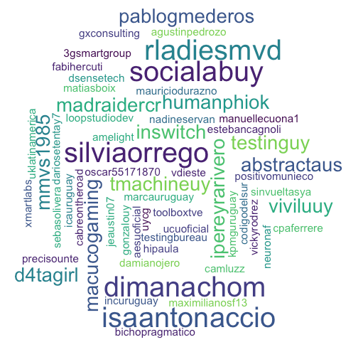
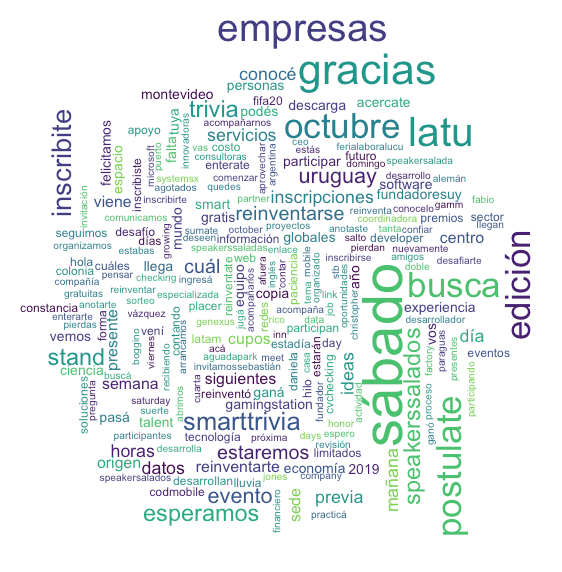
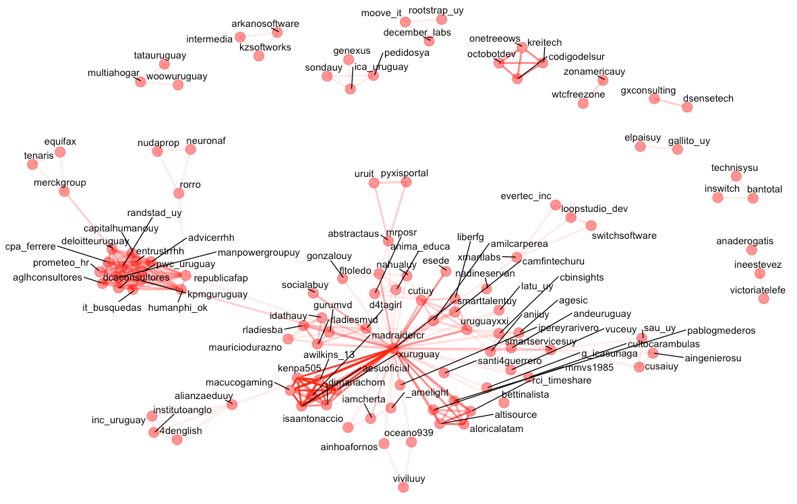

### Tweets Smart Talent Day 2019 

Nube de palabras con los usuarios que mencionaron @SmartTalentUY

Qué palabras se usaron más en esos tweets, sacando las menciones y las urls?

Red de los usuarios que hablaron de Smart Talent y cómo se vincularon entre ellos. Cuanto más oscura la línea más interacciones :)

